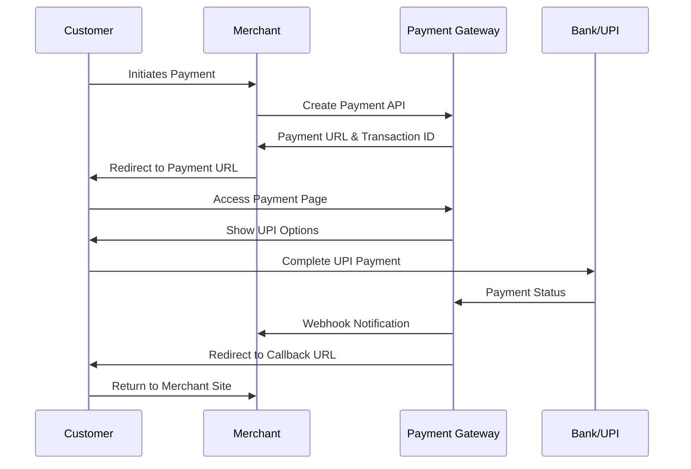

# Merchant Integration Guide

## Overview

This guide provides step-by-step instructions for merchants to integrate with our Payment Gateway. Our gateway supports UPI payments with multiple providers and offers real-time transaction processing with comprehensive reporting.

## Table of Contents

1. [Getting Started](#getting-started)
2. [Authentication](#authentication)
3. [API Endpoints](#api-endpoints)
4. [Payment Flow](#payment-flow)
5. [Integration Methods](#integration-methods)
6. [Webhooks](#webhooks)
7. [Testing](#testing)
8. [Go Live](#go-live)
9. [SDKs and Libraries](#sdks-and-libraries)
10. [Support](#support)

## Getting Started

### 1. Merchant Registration

#### Step 1: Sign Up
1. Visit our merchant portal: `https://your-gateway-domain.com`
2. Click "Sign Up" and select "Merchant Account"
3. Fill in your business details:
   - Business Name
   - Email Address
   - Phone Number
   - Business Type
   - PAN/GST Details

#### Step 2: Account Verification
1. Verify your email address
2. Complete KYC documentation
3. Bank account verification
4. Business license verification

#### Step 3: Get API Credentials
Once approved, you'll receive:
- **Merchant ID**: Unique identifier for your account
- **API Key**: Secret key for API authentication
- **Webhook Secret**: For validating webhook signatures

### 2. Integration Requirements

#### Technical Prerequisites
- HTTPS enabled website/application
- Server-side implementation capability
- Webhook endpoint for status updates
- SSL certificate for secure communication

#### Supported Technologies
- **Languages**: Java, Python, PHP, Node.js, .NET, Ruby
- **Frameworks**: Spring Boot, Django, Laravel, Express.js, ASP.NET
- **Platforms**: Web, Mobile (Android/iOS), Desktop

## Authentication

### API Key Authentication

All API requests must include your API key in the Authorization header:

```http
Authorization: Bearer YOUR_API_KEY
Content-Type: application/json
```

### Security Best Practices

1. **Never expose API keys** in client-side code
2. **Use HTTPS** for all API communications
3. **Implement rate limiting** on your end
4. **Validate webhook signatures** for security
5. **Store API keys securely** using environment variables

## API Endpoints

### Base URL
```
Production: https://api.your-gateway.com
Sandbox: https://sandbox-api.your-gateway.com
```

### 1. Create Payment

**Endpoint:** `POST /api/payments/create`

**Request:**
```json
{
  "amount": 100.00,
  "currency": "INR",
  "paymentMethod": "UPI_QR",
  "description": "Product Purchase",
  "callbackUrl": "https://yoursite.com/payment-success",
  "webhookUrl": "https://yoursite.com/webhook",
  "customerInfo": {
    "name": "John Doe",
    "email": "john@example.com",
    "phone": "+919876543210"
  },
  "orderInfo": {
    "orderId": "ORDER_123",
    "items": [
      {
        "name": "Product Name",
        "quantity": 1,
        "price": 100.00
      }
    ]
  }
}
```

**Response:**
```json
{
  "success": true,
  "message": "Payment created successfully",
  "data": {
    "transactionId": "TXN_1234567890",
    "amount": 100.00,
    "currency": "INR",
    "status": "PENDING",
    "paymentMethod": "UPI_QR",
    "paymentUrl": "https://gateway.com/payment/TXN_1234567890",
    "qrCodeData": "base64_encoded_qr_code",
    "createdAt": "2024-01-01T10:00:00Z"
  }
}
```

### 2. Check Payment Status

**Endpoint:** `GET /api/payments/status/{transactionId}`

**Response:**
```json
{
  "success": true,
  "data": {
    "transactionId": "TXN_1234567890",
    "status": "SUCCESS",
    "amount": 100.00,
    "bankReference": "BANK_REF_123",
    "completedAt": "2024-01-01T10:05:00Z"
  }
}
```

### 3. Get Transaction History

**Endpoint:** `GET /api/transactions/merchant/{merchantId}?range=today`

**Query Parameters:**
- `range`: today, week, month, year, lifetime
- `status`: SUCCESS, FAILED, PENDING
- `limit`: Number of records (default: 50)
- `offset`: Pagination offset

**Response:**
```json
{
  "success": true,
  "data": {
    "transactions": [
      {
        "transactionId": "TXN_1234567890",
        "amount": 100.00,
        "status": "SUCCESS",
        "createdAt": "2024-01-01T10:00:00Z",
        "completedAt": "2024-01-01T10:05:00Z"
      }
    ],
    "pagination": {
      "total": 150,
      "limit": 50,
      "offset": 0
    }
  }
}
```

## Payment Flow

### Standard Payment Flow



### Step-by-Step Process

1. **Payment Initiation**
   - Customer clicks "Pay" on merchant site
   - Merchant calls Create Payment API
   - Receives transaction ID and payment URL

2. **Customer Redirect**
   - Merchant redirects customer to payment URL
   - Customer sees payment page with UPI options

3. **Payment Processing**
   - Customer selects UPI method (QR/App/ID)
   - Completes payment in UPI app
   - Bank processes the transaction

4. **Status Updates**
   - Payment gateway receives bank confirmation
   - Webhook sent to merchant (if configured)
   - Customer redirected to callback URL

5. **Completion**
   - Merchant receives final status
   - Order fulfillment begins
   - Customer receives confirmation

## Integration Methods

### 1. Server-to-Server Integration

**Best for:** E-commerce websites, web applications

```javascript
// Node.js Example
const axios = require('axios');

async function createPayment(orderData) {
  try {
    const response = await axios.post('https://api.your-gateway.com/api/payments/create', {
      amount: orderData.amount,
      paymentMethod: 'UPI_QR',
      description: orderData.description,
      callbackUrl: 'https://yoursite.com/payment-success',
      webhookUrl: 'https://yoursite.com/webhook'
    }, {
      headers: {
        'Authorization': `Bearer ${process.env.PAYMENT_API_KEY}`,
        'Content-Type': 'application/json'
      }
    });

    if (response.data.success) {
      // Redirect customer to payment URL
      return response.data.data.paymentUrl;
    }
  } catch (error) {
    console.error('Payment creation failed:', error);
    throw error;
  }
}
```

```python
# Python Example
import requests
import os

def create_payment(order_data):
    url = "https://api.your-gateway.com/api/payments/create"
    
    headers = {
        "Authorization": f"Bearer {os.getenv('PAYMENT_API_KEY')}",
        "Content-Type": "application/json"
    }
    
    payload = {
        "amount": order_data["amount"],
        "paymentMethod": "UPI_QR",
        "description": order_data["description"],
        "callbackUrl": "https://yoursite.com/payment-success",
        "webhookUrl": "https://yoursite.com/webhook"
    }
    
    response = requests.post(url, json=payload, headers=headers)
    
    if response.status_code == 200:
        data = response.json()
        if data["success"]:
            return data["data"]["paymentUrl"]
    
    raise Exception("Payment creation failed")
```

```php
<?php
// PHP Example
function createPayment($orderData) {
    $url = 'https://api.your-gateway.com/api/payments/create';
    
    $headers = [
        'Authorization: Bearer ' . $_ENV['PAYMENT_API_KEY'],
        'Content-Type: application/json'
    ];
    
    $payload = [
        'amount' => $orderData['amount'],
        'paymentMethod' => 'UPI_QR',
        'description' => $orderData['description'],
        'callbackUrl' => 'https://yoursite.com/payment-success',
        'webhookUrl' => 'https://yoursite.com/webhook'
    ];
    
    $ch = curl_init();
    curl_setopt($ch, CURLOPT_URL, $url);
    curl_setopt($ch, CURLOPT_POST, true);
    curl_setopt($ch, CURLOPT_POSTFIELDS, json_encode($payload));
    curl_setopt($ch, CURLOPT_HTTPHEADER, $headers);
    curl_setopt($ch, CURLOPT_RETURNTRANSFER, true);
    
    $response = curl_exec($ch);
    curl_close($ch);
    
    $data = json_decode($response, true);
    
    if ($data['success']) {
        return $data['data']['paymentUrl'];
    }
    
    throw new Exception('Payment creation failed');
}
?>
```

```java
// Java Example
import org.springframework.http.*;
import org.springframework.web.client.RestTemplate;

@Service
public class PaymentService {
    
    @Value("${payment.gateway.api.key}")
    private String apiKey;
    
    @Value("${payment.gateway.base.url}")
    private String baseUrl;
    
    public String createPayment(PaymentRequest request) {
        RestTemplate restTemplate = new RestTemplate();
        
        HttpHeaders headers = new HttpHeaders();
        headers.setContentType(MediaType.APPLICATION_JSON);
        headers.set("Authorization", "Bearer " + apiKey);
        
        Map<String, Object> payload = Map.of(
            "amount", request.getAmount(),
            "paymentMethod", "UPI_QR",
            "description", request.getDescription(),
            "callbackUrl", "https://yoursite.com/payment-success",
            "webhookUrl", "https://yoursite.com/webhook"
        );
        
        HttpEntity<Map<String, Object>> entity = new HttpEntity<>(payload, headers);
        
        ResponseEntity<PaymentResponse> response = restTemplate.postForEntity(
            baseUrl + "/api/payments/create", 
            entity, 
            PaymentResponse.class
        );
        
        if (response.getStatusCode().is2xxSuccessful() && 
            response.getBody().isSuccess()) {
            return response.getBody().getData().getPaymentUrl();
        }
        
        throw new RuntimeException("Payment creation failed");
    }
}
```

### 2. Mobile App Integration

**Android Example:**
```kotlin
class PaymentService {
    private val apiKey = BuildConfig.PAYMENT_API_KEY
    private val baseUrl = "https://api.your-gateway.com"
    
    suspend fun createPayment(amount: Double, description: String): String {
        val client = OkHttpClient()
        
        val payload = JSONObject().apply {
            put("amount", amount)
            put("paymentMethod", "UPI_INTENT")
            put("description", description)
            put("callbackUrl", "yourapp://payment-success")
        }
        
        val request = Request.Builder()
            .url("$baseUrl/api/payments/create")
            .addHeader("Authorization", "Bearer $apiKey")
            .addHeader("Content-Type", "application/json")
            .post(payload.toString().toRequestBody("application/json".toMediaType()))
            .build()
        
        val response = client.newCall(request).execute()
        val responseBody = response.body?.string()
        
        if (response.isSuccessful && responseBody != null) {
            val jsonResponse = JSONObject(responseBody)
            if (jsonResponse.getBoolean("success")) {
                return jsonResponse.getJSONObject("data").getString("paymentUrl")
            }
        }
        
        throw Exception("Payment creation failed")
    }
}
```

**iOS Example:**
```swift
class PaymentService {
    private let apiKey = Bundle.main.object(forInfoDictionaryKey: "PAYMENT_API_KEY") as! String
    private let baseUrl = "https://api.your-gateway.com"
    
    func createPayment(amount: Double, description: String, completion: @escaping (Result<String, Error>) -> Void) {
        guard let url = URL(string: "\(baseUrl)/api/payments/create") else {
            completion(.failure(PaymentError.invalidURL))
            return
        }
        
        var request = URLRequest(url: url)
        request.httpMethod = "POST"
        request.setValue("Bearer \(apiKey)", forHTTPHeaderField: "Authorization")
        request.setValue("application/json", forHTTPHeaderField: "Content-Type")
        
        let payload: [String: Any] = [
            "amount": amount,
            "paymentMethod": "UPI_INTENT",
            "description": description,
            "callbackUrl": "yourapp://payment-success"
        ]
        
        do {
            request.httpBody = try JSONSerialization.data(withJSONObject: payload)
        } catch {
            completion(.failure(error))
            return
        }
        
        URLSession.shared.dataTask(with: request) { data, response, error in
            if let error = error {
                completion(.failure(error))
                return
            }
            
            guard let data = data,
                  let json = try? JSONSerialization.jsonObject(with: data) as? [String: Any],
                  let success = json["success"] as? Bool,
                  success,
                  let dataObj = json["data"] as? [String: Any],
                  let paymentUrl = dataObj["paymentUrl"] as? String else {
                completion(.failure(PaymentError.invalidResponse))
                return
            }
            
            completion(.success(paymentUrl))
        }.resume()
    }
}
```

### 3. Frontend Integration (Client-Side)

**React Example:**
```jsx
import React, { useState } from 'react';
import axios from 'axios';

const PaymentButton = ({ amount, description, onSuccess, onError }) => {
  const [loading, setLoading] = useState(false);

  const handlePayment = async () => {
    setLoading(true);
    
    try {
      // Call your backend to create payment
      const response = await axios.post('/api/create-payment', {
        amount,
        description
      });
      
      if (response.data.success) {
        // Redirect to payment gateway
        window.location.href = response.data.paymentUrl;
      } else {
        onError(response.data.error);
      }
    } catch (error) {
      onError('Payment initiation failed');
    } finally {
      setLoading(false);
    }
  };

  return (
    <button 
      onClick={handlePayment} 
      disabled={loading}
      className="payment-button"
    >
      {loading ? 'Processing...' : `Pay ₹${amount}`}
    </button>
  );
};
```

**Vue.js Example:**
```vue
<template>
  <button 
    @click="initiatePayment" 
    :disabled="loading"
    class="payment-button"
  >
    {{ loading ? 'Processing...' : `Pay ₹${amount}` }}
  </button>
</template>

<script>
export default {
  props: ['amount', 'description'],
  data() {
    return {
      loading: false
    };
  },
  methods: {
    async initiatePayment() {
      this.loading = true;
      
      try {
        const response = await this.$http.post('/api/create-payment', {
          amount: this.amount,
          description: this.description
        });
        
        if (response.data.success) {
          window.location.href = response.data.paymentUrl;
        } else {
          this.$emit('error', response.data.error);
        }
      } catch (error) {
        this.$emit('error', 'Payment initiation failed');
      } finally {
        this.loading = false;
      }
    }
  }
};
</script>
```

## Webhooks

### Setting Up Webhooks

Webhooks provide real-time payment status updates to your server.

#### 1. Create Webhook Endpoint

```javascript
// Node.js Express Example
const express = require('express');
const crypto = require('crypto');
const app = express();

app.use(express.raw({ type: 'application/json' }));

app.post('/webhook', (req, res) => {
  const signature = req.headers['x-webhook-signature'];
  const payload = req.body;
  
  // Verify webhook signature
  const expectedSignature = crypto
    .createHmac('sha256', process.env.WEBHOOK_SECRET)
    .update(payload)
    .digest('hex');
  
  if (signature !== expectedSignature) {
    return res.status(401).send('Invalid signature');
  }
  
  const event = JSON.parse(payload);
  
  // Handle payment status update
  switch (event.type) {
    case 'payment.success':
      handlePaymentSuccess(event.data);
      break;
    case 'payment.failed':
      handlePaymentFailed(event.data);
      break;
    case 'payment.pending':
      handlePaymentPending(event.data);
      break;
  }
  
  res.status(200).send('OK');
});

function handlePaymentSuccess(paymentData) {
  // Update order status
  // Send confirmation email
  // Trigger fulfillment
  console.log('Payment successful:', paymentData.transactionId);
}

function handlePaymentFailed(paymentData) {
  // Update order status
  // Send failure notification
  console.log('Payment failed:', paymentData.transactionId);
}
```

#### 2. Webhook Event Types

| Event Type | Description | When Triggered |
|------------|-------------|----------------|
| `payment.created` | Payment initiated | When payment is created |
| `payment.pending` | Payment in progress | UPI request sent |
| `payment.success` | Payment completed | Bank confirms payment |
| `payment.failed` | Payment failed | Bank declines payment |
| `payment.expired` | Payment timeout | Payment link expires |

#### 3. Webhook Payload Example

```json
{
  "type": "payment.success",
  "timestamp": "2024-01-01T10:05:00Z",
  "data": {
    "transactionId": "TXN_1234567890",
    "merchantId": "MERCHANT_123",
    "amount": 100.00,
    "currency": "INR",
    "status": "SUCCESS",
    "bankReference": "BANK_REF_123",
    "paymentMethod": "UPI_QR",
    "customerInfo": {
      "name": "John Doe",
      "email": "john@example.com"
    },
    "orderInfo": {
      "orderId": "ORDER_123"
    },
    "completedAt": "2024-01-01T10:05:00Z"
  }
}
```

### Webhook Security

#### 1. Signature Verification

Always verify webhook signatures to ensure authenticity:

```python
import hmac
import hashlib

def verify_webhook_signature(payload, signature, secret):
    expected_signature = hmac.new(
        secret.encode('utf-8'),
        payload.encode('utf-8'),
        hashlib.sha256
    ).hexdigest()
    
    return hmac.compare_digest(signature, expected_signature)
```

#### 2. Idempotency

Handle duplicate webhook deliveries:

```javascript
const processedWebhooks = new Set();

app.post('/webhook', (req, res) => {
  const webhookId = req.headers['x-webhook-id'];
  
  if (processedWebhooks.has(webhookId)) {
    return res.status(200).send('Already processed');
  }
  
  // Process webhook
  processWebhook(req.body);
  
  processedWebhooks.add(webhookId);
  res.status(200).send('OK');
});
```

## Testing

### 1. Sandbox Environment

Use our sandbox environment for testing:

```
Sandbox API: https://sandbox-api.your-gateway.com
Sandbox Dashboard: https://sandbox.your-gateway.com
```

#### Test Credentials
```
Merchant ID: test_merchant_123
API Key: test_sk_1234567890abcdef
Webhook Secret: test_whsec_abcdef1234567890
```

### 2. Test Payment Scenarios

#### Successful Payment
```json
{
  "amount": 100.00,
  "paymentMethod": "UPI_QR",
  "description": "Test Success Payment"
}
```

#### Failed Payment
```json
{
  "amount": 1.00,
  "paymentMethod": "UPI_QR",
  "description": "Test Failure Payment"
}
```

#### Timeout Payment
```json
{
  "amount": 0.01,
  "paymentMethod": "UPI_QR",
  "description": "Test Timeout Payment"
}
```

### 3. Testing Tools

#### Postman Collection
Download our Postman collection for API testing:
```
https://api.your-gateway.com/postman/collection.json
```

#### Webhook Testing
Use ngrok for local webhook testing:
```bash
# Install ngrok
npm install -g ngrok

# Expose local server
ngrok http 3000

# Use the ngrok URL as webhook URL
# https://abc123.ngrok.io/webhook
```

### 4. Test UPI IDs

For testing different scenarios:

| UPI ID | Scenario |
|--------|----------|
| `success@test` | Always succeeds |
| `failure@test` | Always fails |
| `timeout@test` | Times out |
| `pending@test` | Stays pending |

## Go Live

### 1. Production Checklist

#### Technical Requirements
- [ ] SSL certificate installed
- [ ] Webhook endpoint secured
- [ ] API key stored securely
- [ ] Error handling implemented
- [ ] Logging configured
- [ ] Rate limiting implemented

#### Business Requirements
- [ ] KYC documents submitted
- [ ] Bank account verified
- [ ] Settlement account configured
- [ ] Pricing agreement signed
- [ ] Go-live approval received

### 2. Production Configuration

#### Environment Variables
```bash
# Production API Configuration
PAYMENT_GATEWAY_API_KEY=live_sk_your_production_key
PAYMENT_GATEWAY_BASE_URL=https://api.your-gateway.com
WEBHOOK_SECRET=live_whsec_your_webhook_secret

# Database Configuration
DATABASE_URL=your_production_database_url

# Security Configuration
JWT_SECRET=your_jwt_secret
ENCRYPTION_KEY=your_encryption_key
```

#### Production API Endpoints
```
Base URL: https://api.your-gateway.com
Dashboard: https://dashboard.your-gateway.com
```

### 3. Monitoring and Alerts

#### Key Metrics to Monitor
- Payment success rate
- API response times
- Webhook delivery success
- Error rates
- Transaction volumes

#### Recommended Alerts
- Payment success rate drops below 95%
- API response time exceeds 5 seconds
- Webhook delivery failures
- High error rates
- Unusual transaction patterns

## SDKs and Libraries

### Official SDKs

#### Node.js SDK
```bash
npm install @your-gateway/node-sdk
```

```javascript
const PaymentGateway = require('@your-gateway/node-sdk');

const gateway = new PaymentGateway({
  apiKey: process.env.PAYMENT_API_KEY,
  environment: 'production' // or 'sandbox'
});

const payment = await gateway.payments.create({
  amount: 100.00,
  description: 'Product Purchase'
});
```

#### Python SDK
```bash
pip install your-gateway-python
```

```python
import your_gateway

gateway = your_gateway.Client(
    api_key=os.getenv('PAYMENT_API_KEY'),
    environment='production'
)

payment = gateway.payments.create(
    amount=100.00,
    description='Product Purchase'
)
```

#### PHP SDK
```bash
composer require your-gateway/php-sdk
```

```php
use YourGateway\Client;

$gateway = new Client([
    'api_key' => $_ENV['PAYMENT_API_KEY'],
    'environment' => 'production'
]);

$payment = $gateway->payments->create([
    'amount' => 100.00,
    'description' => 'Product Purchase'
]);
```

### Community Libraries

#### React Components
```bash
npm install @your-gateway/react-components
```

```jsx
import { PaymentButton } from '@your-gateway/react-components';

<PaymentButton
  amount={100.00}
  description="Product Purchase"
  onSuccess={handleSuccess}
  onError={handleError}
/>
```

## Error Handling

### Common Error Codes

| Code | Description | Resolution |
|------|-------------|------------|
| `INVALID_API_KEY` | API key is invalid | Check API key format |
| `INSUFFICIENT_BALANCE` | Merchant balance low | Add funds to account |
| `INVALID_AMOUNT` | Amount validation failed | Check amount format |
| `DUPLICATE_TRANSACTION` | Duplicate transaction ID | Use unique transaction IDs |
| `WEBHOOK_DELIVERY_FAILED` | Webhook not delivered | Check webhook endpoint |

### Error Response Format

```json
{
  "success": false,
  "error": {
    "code": "INVALID_AMOUNT",
    "message": "Amount must be greater than 0",
    "details": {
      "field": "amount",
      "value": -10.00
    }
  },
  "timestamp": "2024-01-01T10:00:00Z"
}
```

### Retry Logic

Implement exponential backoff for API calls:

```javascript
async function apiCallWithRetry(apiCall, maxRetries = 3) {
  for (let attempt = 1; attempt <= maxRetries; attempt++) {
    try {
      return await apiCall();
    } catch (error) {
      if (attempt === maxRetries) throw error;
      
      const delay = Math.pow(2, attempt) * 1000; // Exponential backoff
      await new Promise(resolve => setTimeout(resolve, delay));
    }
  }
}
```

## Support

### Documentation
- **API Reference:** https://docs.your-gateway.com/api
- **Integration Guides:** https://docs.your-gateway.com/guides
- **SDKs:** https://docs.your-gateway.com/sdks

### Developer Support
- **Email:** developers@your-gateway.com
- **Slack:** https://your-gateway.slack.com
- **GitHub:** https://github.com/your-gateway

### Business Support
- **Email:** support@your-gateway.com
- **Phone:** +91-80-1234-5678
- **Hours:** 9 AM - 6 PM IST (Mon-Fri)

### Emergency Support
- **24/7 Hotline:** +91-80-9876-5432
- **Status Page:** https://status.your-gateway.com

### Resources
- **Postman Collection:** https://api.your-gateway.com/postman
- **Sample Code:** https://github.com/your-gateway/samples
- **Video Tutorials:** https://youtube.com/your-gateway
- **Webinars:** https://your-gateway.com/webinars

---

## Appendix

### A. Payment Method Details

#### UPI QR Code
- Universal QR code compatible with all UPI apps
- Dynamic QR generation for each transaction
- Automatic amount pre-filling
- Real-time status updates

#### UPI Intent
- Direct deep links to specific UPI apps
- Supports PhonePe, Google Pay, Paytm, Amazon Pay
- Seamless app-to-app experience
- Automatic return to merchant app

#### UPI ID
- Direct payment requests to UPI IDs
- Push notifications to customer
- Collect requests with amount pre-filled
- Status tracking and updates

### B. Compliance and Security

#### PCI DSS Compliance
- Level 1 PCI DSS certified
- Secure data transmission
- No card data storage
- Regular security audits

#### Data Protection
- GDPR compliant
- Data encryption at rest and in transit
- Regular data backups
- Secure data deletion

#### Regulatory Compliance
- RBI guidelines compliance
- Payment aggregator license
- KYC/AML procedures
- Regular compliance audits

### C. Pricing

#### Transaction Fees
- UPI: 0.5% + ₹2 per transaction
- Volume discounts available
- No setup fees
- No monthly fees

#### Settlement
- T+1 settlement cycle
- Automatic settlement to bank account
- Settlement reports available
- Hold period for new merchants

This comprehensive integration guide provides everything merchants need to successfully integrate with our payment gateway. For additional support or custom integration requirements, please contact our developer support team.